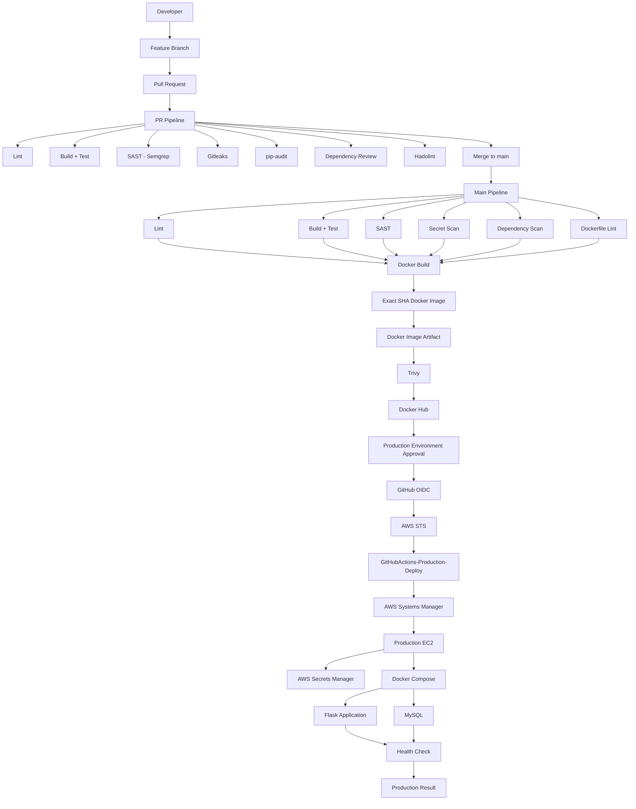

# 🔐 Secure CI/CD Pipeline Lab

A production-style **DevSecOps CI/CD capstone project** built around a Python Flask application, MySQL, Docker, GitHub Actions, Docker Hub, Trivy, AWS OIDC, AWS STS, AWS IAM, AWS Systems Manager, AWS Secrets Manager, and Docker Compose.

This project is not just a CI/CD demo. It is the result of progressively applying concepts learned across multiple earlier projects and solving problems discovered in those projects.

The main goal was to answer:

> **How do I take application code from a Pull Request, validate it, secure it, build one exact artifact, promote that exact artifact, and deploy it to AWS production without using long-lived AWS credentials or manually copying application code to the server?**

---

# 📌 What This Project Represents

This project combines everything learned from the previous CI/CD and DevSecOps projects into one complete flow:

```text
Developer
    ↓
Feature Branch
    ↓
Pull Request
    ↓
CI + Security Validation
    ↓
Merge to main
    ↓
Complete Production Pipeline
    ↓
Build exact Docker image
    ↓
Scan exact same image
    ↓
Push validated image
    ↓
Production approval
    ↓
GitHub OIDC
    ↓
AWS STS
    ↓
AWS IAM Role
    ↓
AWS SSM
    ↓
Production EC2
    ↓
AWS Secrets Manager
    ↓
Docker Compose
    ↓
Flask + MySQL
    ↓
Health Check
    ↓
Production Application
```

---

# 🎯 Why I Built This Project

Before this project, I already had experience with:

- Docker
- Docker Compose
- Docker Hub
- GitHub Actions
- GitHub Actions reusable workflows
- Inputs
- Outputs
- Matrix strategies
- `needs`
- Parallel jobs
- Security scanning
- Trivy
- CI/CD concepts

But those concepts existed across different projects.

The purpose of this project was to bring them together into a **single production-style DevSecOps pipeline**.

The biggest difference was that I wanted to move beyond:

```text
Build → Push → Deploy
```

and create:

```text
PR Validation
    ↓
Security Gates
    ↓
Build Once
    ↓
Preserve Exact Artifact
    ↓
Scan Exact Artifact
    ↓
Promote Exact Artifact
    ↓
Production Approval
    ↓
Secure AWS Authentication
    ↓
Deploy
    ↓
Verify Production
```

---

# 🧠 Learning Evolution

This project was built after learning CI/CD through multiple previous projects.

## Project 1 — Three-Tier Java Application

The three-tier project was where I learned the basic Docker CI/CD workflow.

The general process was:

```text
Source Code
    ↓
Docker Build
    ↓
Docker Push
    ↓
Docker Hub
    ↓
Pull Image
    ↓
Trivy Scan
```

At that stage I learned:

- Dockerizing an application
- Docker Compose
- Building Docker images
- Tagging images
- Docker Hub authentication
- Docker push
- Docker pull
- Basic GitHub Actions
- Basic image scanning

### The problem I later identified

The pipeline was doing something like:

```text
Build Image
    ↓
Push Image
    ↓
Pull Image
    ↓
Scan Image
```

This works as a basic demonstration, but it is not the strongest artifact-promotion model.

The concern is that the scanner is not working directly with the exact local build artifact anymore. It is pulling from the registry and depending on the image reference/tag.

For example:

```text
Build
    ↓
image: app:latest
    ↓
Push
    ↓
Docker Hub
    ↓
Pull latest
    ↓
Scan
```

A mutable tag such as `latest` is not a reliable identity for a release.

A stronger approach is:

```text
Build Once
    ↓
Preserve Exact Image
    ↓
Scan Exact Image
    ↓
Push Exact Image
```

That problem became one of the most important lessons carried into the later projects.

---

# 🐐 Project 2 — OWASP NodeGoat DevSecOps Capstone

The NodeGoat project took the pipeline much further.

This is where I learned and practiced:

- Reusable workflows
- `workflow_call`
- Workflow inputs
- Workflow outputs
- `needs`
- Matrix strategies
- Parallel execution
- Security gates
- SAST
- Gitleaks
- Dependency scanning
- Hadolint
- Trivy
- SARIF reports
- Artifacts
- Docker image preservation

One of the most important lessons was solving the previous:

```text
Build → Push → Pull → Scan
```

pattern.

Instead, the project moved toward:

```text
Docker Build
    ↓
Save Image
    ↓
Upload Artifact
    ↓
Download Artifact
    ↓
Load Exact Image
    ↓
Trivy
    ↓
Push
```

That introduced the concept:

# Build Once → Scan Same Image → Push Same Image

This idea became the foundation for the current project.

---

# 🚀 Project 3 — Secure CI/CD Pipeline Lab

The current project takes the NodeGoat lessons and pushes them much further.

Instead of having a single pipeline, the architecture is split into:

```text
Pull Request Pipeline
        +
Main Production Pipeline
```

The PR pipeline validates code before merge.

The main pipeline performs the complete CI/CD and production deployment process after merge.

The major new concepts introduced here were:

- Production environment approval
- GitHub OIDC
- AWS STS
- AWS IAM trust policies
- AWS IAM permission policies
- AWS Systems Manager
- EC2 IAM role
- AWS Secrets Manager
- Temporary AWS credentials
- Production deployment through SSM
- Exact SHA-based production deployments
- Health verification after deployment
- Least-privilege GitHub Actions permissions
- Action SHA pinning
- Production runtime provisioning
- Production Compose deployment
- End-to-end application delivery

---

# 🏗️ Final Architecture



---

# 🔄 Pull Request Pipeline

The Pull Request pipeline exists to stop bad or insecure code before it reaches `main`.

```text
Feature Branch
      ↓
Pull Request
      ↓
Lint
      ↓
        ┌───────────────────────┐
        │ Build + Test          │
        │ SAST                  │
        │ Secret Scan           │
        │ Dependency Scan       │
        │ Dependency Review     │
        │ Dockerfile Lint       │
        └───────────────────────┘
      ↓
PR Result
```

The PR pipeline does **not**:

- Build the production image
- Push the image to Docker Hub
- Deploy to AWS
- Use the production AWS deployment role

This separation is intentional.

A Pull Request should validate the change, not deploy it.

---

# ⚡ PR Pipeline Parallelism

One of the concepts carried forward from the NodeGoat project was job parallelism.

After lint completes, these jobs can run independently:

```text
                ┌── Build/Test
                │
Lint ───────────┼── SAST
                │
                ├── Secret Scan
                │
                ├── Dependency Scan
                │
                ├── Dependency Review
                │
                └── Dockerfile Lint
```

This is achieved using:

```yaml
needs: lint
```

for each downstream job.

This is different from making every security job wait for another security job.

The goal is:

```text
Run independent checks in parallel
        ↓
Reduce unnecessary waiting
```

---

# 🚀 Main Production Pipeline

When code reaches `main`:

```text
Push to main
    ↓
Lint
    ↓
Build/Test
    ↓
SAST
    ↓
Secret Scan
    ↓
Dependency Scan
    ↓
Dockerfile Lint
    ↓
Docker Build
    ↓
Trivy
    ↓
Docker Push
    ↓
Production Deployment
    ↓
Production Health Check
```

---

# 🧩 Reusable Workflows

Instead of placing everything in one giant YAML file, the project uses reusable workflows with:

```yaml
workflow_call:
```

The reusable workflows include:

```text
reusable-lint.yml
reusable-build-test.yml
reusable-sast.yml
reusable-secret-scan.yml
reusable-dependency-scan.yml
reusable-dependency-review.yml
reusable-dockerfile-lint.yml
reusable-docker-build.yml
reusable-trivy-scan.yml
reusable-docker-push.yml
reusable-production-deploy.yml
```

This was an important evolution from earlier CI/CD projects.

---

# 📥 Workflow Inputs

Reusable workflows receive information using:

```yaml
inputs:
```

For example, the Docker build workflow receives:

```text
image_name
image_tag
docker_username
```

The production deployment receives:

```text
image-tag
```

This allows the same reusable workflow to work with different values.

---

# 📤 Workflow Outputs

Another important lesson from NodeGoat was:

```yaml
outputs:
```

The current pipeline extends this idea heavily.

Examples:

```text
lint_result
test_result
sast_result
secret_scan_result
dependency_scan_result
dockerfile_lint_result
image_ref
artifact_name
trivy_result
deployment_result
```

Example flow:

```text
Docker Build
      ↓
image_ref
      ↓
Trivy
      ↓
exact image
```

And:

```text
Production Deploy
      ↓
deployment_result
      ↓
Main Pipeline
      ↓
show-result
```

This demonstrates how jobs and reusable workflows can exchange information.

---

# 🔢 Matrix Testing

The lint and build/test workflows use Python matrices.

```text
Python 3.11
Python 3.12
Python 3.13
```

Conceptually:

```text
                 ┌── Python 3.11
                 │
Matrix ──────────┼── Python 3.12
                 │
                 └── Python 3.13
```

The goal is to verify that the application works across multiple supported Python versions.

The matrix uses:

```yaml
fail-fast: false
```

so one failing version does not immediately cancel the other matrix jobs.

This provides a more complete test result.

---

# 🛡️ Security Pipeline

The project uses multiple layers of security.

```text
Source Code Security
        ↓
SAST
        ↓
Secret Security
        ↓
Dependency Security
        ↓
Dockerfile Security
        ↓
Container Image Security
        ↓
Production Security
```

---

# 1. Ruff — Code Quality

Ruff is used to detect Python code-quality issues.

Example:

```bash
ruff check app tests
```

It catches issues such as:

- Import problems
- Unused or problematic code patterns
- Style violations
- Certain unsafe patterns

Ruff previously caught issues such as:

```text
I001 import order
BLE001 blind exception
```

Those were fixed before the pipeline was considered clean.

---

# 2. Pytest — Automated Testing

The application uses Pytest.

Current tests validate:

- Home page
- Security headers
- Health endpoint behavior

The final local test result was:

```text
3 passed
```

---

# 3. Semgrep — SAST

Semgrep is used for Static Application Security Testing.

```text
Application Source
       ↓
Semgrep
       ↓
SARIF Report
       ↓
GitHub Security
```

The SARIF report can be uploaded to GitHub's security reporting system.

---

# 4. Gitleaks — Secret Scanning

Gitleaks scans the repository for accidentally committed secrets.

The checkout uses:

```yaml
fetch-depth: 0
```

This was intentional.

A shallow checkout only contains limited history.

The full-history checkout allows Gitleaks to inspect the repository's complete Git history.

The principle is:

```text
Don't only ask:
"Is a secret in the latest commit?"

Also ask:
"Was a secret ever committed into the repository history?"
```

---

# 5. pip-audit — Dependency Security

The dependency scanner examines:

```text
requirements.txt
```

and produces:

```text
pip-audit-report.txt
pip-audit-report.json
```

The reports are uploaded as GitHub Actions artifacts.

This gives both:

```text
Human-readable output
+
Machine-readable JSON
```

---

# 6. Dependency Review

Dependency Review is used in the PR pipeline.

It evaluates dependency changes in a Pull Request.

The project configured the security gate to fail on:

```text
critical
```

severity dependency changes.

---

# 7. Hadolint — Dockerfile Security

Hadolint scans the Dockerfile before the production image is built.

```text
Dockerfile
   ↓
Hadolint
   ↓
Build allowed
```

This shifts container security earlier in the pipeline.

---

# 8. Trivy — Container Image Security

Trivy scans the **actual built Docker image**.

The project is configured to treat:

```text
HIGH
CRITICAL
```

vulnerabilities as the relevant release gate.

The scan is configured with:

```yaml
severity: "CRITICAL,HIGH"
```

and:

```yaml
limit-severities-for-sarif: true
```

The second setting became important because the SARIF output behavior initially caused higher-severity filtering to behave differently than expected.

---

# 🐳 The Most Important Docker Lesson

One of the biggest improvements over the earlier three-tier project was changing:

```text
Build
 ↓
Push
 ↓
Pull
 ↓
Scan
```

into:

```text
Build
 ↓
Save
 ↓
Artifact
 ↓
Download
 ↓
Load
 ↓
Scan
 ↓
Push
```

The reason is simple:

> **The artifact we scan should be the same artifact we promote.**

The pipeline therefore follows:

```text
docker build
       ↓
docker save
       ↓
docker-image.tar.gz
       ↓
GitHub Actions Artifact
       ↓
download-artifact
       ↓
docker load
       ↓
Trivy
       ↓
docker push
```

---

# 🔒 Build Once → Scan Same Image → Push Same Image

The Docker build workflow generates:

```text
image_ref
artifact_name
```

The Trivy workflow receives those values.

Therefore:

```text
Build Workflow
     │
     ├── image_ref
     │
     └── artifact_name
              ↓
         Trivy Workflow
              ↓
       Exact same image
```

This was one of the main architectural lessons carried over from the NodeGoat project.

---

# 🏷️ Immutable SHA-Based Image Tags

The application image uses:

```yaml
image_tag: ${{ github.sha }}
```

Therefore each commit creates an image like:

```text
aniruddhakharve/secure-cicd-pipeline-lab:<full-github-sha>
```

The project intentionally does not use:

```text
latest
```

for the application release image.

This provides traceability:

```text
Git Commit
    ↓
Docker Tag
    ↓
Docker Image
    ↓
Production Deployment
```

---

# 🧠 Important Variable Syntax Lesson

One confusion encountered during the project was the difference between:

```text
${{ github.sha }}
```

and:

```text
${IMAGE_TAG}
```

They belong to different systems.

GitHub Actions expression:

```yaml
${{ github.sha }}
```

is evaluated by GitHub Actions.

Docker Compose variable:

```text
${IMAGE_TAG}
```

is evaluated by Docker Compose from the environment.

The flow is:

```text
GitHub Actions
${{ github.sha }}
        ↓
Actual commit SHA
        ↓
.env
IMAGE_TAG=actual-sha
        ↓
Docker Compose
${IMAGE_TAG}
        ↓
Docker image
```

GitHub Actions does not automatically evaluate GitHub expressions inside arbitrary files.

---

# 🐳 Production Docker Compose Design

The production Compose file does not build the application.

It uses:

```yaml
image: ${DOCKER_USERNAME}/secure-cicd-pipeline-lab:${IMAGE_TAG}
```

This means:

```text
EC2
 ↓
docker compose pull
 ↓
Pull pre-built image
```

instead of:

```text
EC2
 ↓
Dockerfile build
```

This is important because the production server should receive the already validated artifact.

---

# 🧪 Local Docker Testing vs Production Docker Deployment

For local development, Compose can temporarily use:

```yaml
build:
  context: .
  dockerfile: Dockerfile
```

Then:

```bash
docker compose up -d --build
```

For production:

```yaml
image: ${DOCKER_USERNAME}/secure-cicd-pipeline-lab:${IMAGE_TAG}
```

This creates two different purposes:

```text
Local
→ Build from working tree

Production
→ Pull validated immutable image
```

The production configuration remains image-based.

---

# 🐛 Trivy Base Image Problem

During development, a Debian-based Python image was tested with Trivy.

The scan produced:

```text
44 HIGH
0 CRITICAL
```

OS vulnerabilities.

This became an important real-world lesson:

> The application code can be clean while the base image still introduces vulnerabilities.

Instead of ignoring the scan, the Dockerfile was changed to an Alpine-based Python image:

```dockerfile
FROM python:3.12-alpine
```

The resulting image had no HIGH/CRITICAL OS vulnerabilities in the relevant local test.

This demonstrated why image scanning must happen after the actual image is built.

---

# 🔑 Docker Username vs Docker Password

Another useful GitHub Actions lesson came from Docker authentication.

The Docker username was initially treated like a secret.

This caused problems when passing values between jobs because GitHub Actions applies special handling to secret-derived values.

The final design separates:

```text
Docker Username
→ Repository Variable

Docker Password / Access Token
→ GitHub Secret
```

This makes sense because:

```text
Username
→ Not sensitive

Password / Token
→ Sensitive
```

The final Docker push workflow therefore receives:

```text
docker_username
```

as an input and:

```text
docker_password
```

as a workflow secret.

---

# 🔐 GitHub Actions Least Privilege

Another security improvement was reducing unnecessary workflow permissions.

The main pipeline uses:

```yaml
permissions:
  contents: read
```

The SAST job gets:

```yaml
permissions:
  contents: read
  security-events: write
```

The Trivy job gets:

```yaml
permissions:
  contents: read
  security-events: write
```

The production deployment gets:

```yaml
permissions:
  id-token: write
  contents: read
```

This creates a model like:

```text
Normal CI Job
    ↓
contents: read

Security Reporting Job
    ↓
contents: read
security-events: write

AWS Deployment Job
    ↓
contents: read
id-token: write
```

The goal is:

> Give each job only the permissions it actually needs.

---

# 📌 GitHub Action SHA Pinning

Third-party Actions were pinned to commit SHAs rather than relying only on mutable version tags.

The project eventually standardized this across the workflows.

Example:

```yaml
uses: actions/checkout@<commit-sha>
```

This improves supply-chain reproducibility because the workflow points to a specific action revision.

The final two remaining version-based actions were also pinned during the final hardening pass.

---

# 🏭 Production Environment Approval

The production deployment uses a GitHub Environment:

```text
Production
```

The deployment job is associated with:

```yaml
environment: Production
```

This allows a required approval gate before production deployment.

The final flow becomes:

```text
Docker Push
    ↓
Production Environment
    ↓
Manual Approval
    ↓
AWS Deployment
```

This is a deliberate separation between:

```text
"Image is ready"
```

and:

```text
"Deploy it to production"
```

---

# ☁️ AWS OIDC

One of the biggest new concepts in this project was GitHub OIDC.

Earlier projects relied on Docker Hub authentication and standard CI/CD concepts.

This project needed secure GitHub → AWS authentication.

The architecture is:

```text
GitHub Actions
      ↓
OIDC Identity Token
      ↓
AWS STS
      ↓
Temporary Credentials
      ↓
IAM Role
      ↓
AWS API
```

No long-lived AWS access key is required for the deployment job.

---

# 🔄 OIDC vs STS

These two concepts are related but not identical.

## OIDC

OIDC provides the identity proof.

Conceptually:

```text
GitHub:
"I am this GitHub workflow."
```

## AWS STS

STS exchanges that trusted identity for temporary AWS credentials.

Conceptually:

```text
GitHub OIDC Token
        ↓
AWS STS
        ↓
Temporary AWS Credentials
```

Therefore:

```text
OIDC
→ Identity

STS
→ Temporary credentials
```

---

# 🔐 GitHub Deployment IAM Role

The deployment uses a dedicated IAM role:

```text
GitHubActions-Production-Deploy
```

The role has two important aspects.

## Trust Policy

The trust policy answers:

> **Who is allowed to assume this role?**

The policy restricts the trusted GitHub OIDC identity.

The production GitHub Environment is part of that trust boundary.

## Permissions Policy

The permissions policy answers:

> **What can the role do after assuming it?**

The deployment role is restricted primarily to SSM-related operations required to reach the production instance.

The important mental model is:

```text
Trust Policy
→ WHO can assume?

Permissions Policy
→ WHAT can they do?
```

---

# 🛠️ AWS Systems Manager

The deployment does not use SSH.

Instead:

```text
GitHub Actions
    ↓
AWS SSM SendCommand
    ↓
Production EC2
    ↓
SSM Agent
    ↓
Shell Command
```

This allows the GitHub workflow to execute commands on the production server through Systems Manager.

---

# 🖥️ Why a Separate EC2 IAM Role Exists

The GitHub deployment role and the EC2 runtime role are different.

## GitHub Role

```text
GitHubActions-Production-Deploy
```

Purpose:

```text
GitHub Actions → AWS API → SSM
```

## EC2 Role

```text
ProductionEC2-SSM-Role
```

Purpose:

```text
EC2 / SSM Agent
    ↓
AWS APIs needed by the server
```

This is an important separation of trust.

---

# 🔐 EC2 IAM Permissions

The EC2 role receives permission for the production secret.

The server therefore has a controlled path:

```text
EC2
 ↓
Secrets Manager
 ↓
secure-cicd-pipeline-lab/production
```

The secret access is restricted to that production secret instead of giving the EC2 instance unrestricted Secrets Manager access.

---

# 🔑 AWS Secrets Manager

Production database credentials are stored in:

```text
secure-cicd-pipeline-lab/production
```

The secret contains values such as:

```text
MYSQL_DATABASE
MYSQL_USER
MYSQL_PASSWORD
MYSQL_ROOT_PASSWORD
```

The deployment workflow retrieves these values on the EC2 host.

The values are not hard-coded into:

```text
docker-compose.yml
```

and they are not committed to Git.

---

# 🔒 Production `.env`

The deployment workflow generates:

```text
/opt/secure-cicd-pipeline-lab/.env
```

It contains:

```text
DOCKER_USERNAME
IMAGE_TAG
MYSQL_DATABASE
MYSQL_USER
MYSQL_PASSWORD
MYSQL_ROOT_PASSWORD
```

The workflow uses restrictive permissions such as:

```bash
umask 077
```

and:

```bash
chmod 600
```

The temporary secret JSON file is also removed after use.

The important design is:

```text
Git
→ No production DB password

GitHub Actions
→ No plaintext DB password in repository

EC2
→ Retrieves secret from Secrets Manager

Docker Compose
→ Receives environment values
```

---

# 🧩 Production Runtime Installation

The production workflow is designed so that the application runtime can be provisioned through SSM.

It checks for:

```text
AWS CLI
Docker Engine
Docker Compose
```

If they are missing, the workflow installs them.

This means the application deployment is not dependent on manually installing the application runtime first.

The SSM Agent itself is treated as an infrastructure prerequisite.

---

# 🐛 SSM Command Result Problem

One subtle issue discovered during development was SSM command result handling.

The SSM waiter can fail before the actual command result is printed.

Instead of trusting only:

```bash
aws ssm wait command-executed
```

the workflow uses:

```bash
aws ssm get-command-invocation
```

and checks:

```text
Status
ResponseCode
StandardOutputContent
StandardErrorContent
```

The workflow intentionally uses:

```bash
... || true
```

during the waiter.

Why?

Because the next step is responsible for reading the actual SSM result and enforcing failure.

Conceptually:

```text
Wait
 ↓
Don't hide remote failure information
 ↓
Read actual invocation
 ↓
Check Status + ResponseCode
 ↓
Fail workflow if remote command failed
```

---

# 🐛 Docker Compose `Error` Output Confusion

Another useful troubleshooting lesson came from:

```text
StandardErrorContent
```

appearing to contain Docker Compose progress.

This initially looked like an error.

The actual result was:

```text
Status: Success
ResponseCode: 0
```

Docker Compose can write progress information to stderr even when the command succeeds.

Therefore:

```text
stderr output
≠ automatically command failure
```

The deployment correctly determines success using:

```text
Status
+
ResponseCode
```

rather than assuming anything in the `Error` field means failure.

---

# 🐛 Dependency Review Failure

The Dependency Review workflow initially failed because GitHub's dependency graph functionality was not enabled for the repository.

The lesson was:

> A security action can be configured correctly while still depending on repository-level platform settings.

The dependency graph was enabled, the workflow was rerun, and the dependency review passed.

---

# 🐛 Trivy SARIF Severity Problem

The Trivy configuration initially used:

```yaml
severity: "CRITICAL,HIGH"
```

However, SARIF output behavior meant that the report could still contain lower severities unless the SARIF severity filtering was explicitly limited.

The fix was:

```yaml
limit-severities-for-sarif: true
```

This created the intended behavior:

```text
Trivy
 ↓
HIGH / CRITICAL gate
 ↓
SARIF contains the intended severity range
```

This was a good example of why reading tool behavior matters instead of assuming one configuration option controls every output format identically.

---

# 🐛 Local Python Dependency Problem

When the application tests were first run locally after adding the UI:

```bash
python -m pytest
```

the test collection failed with:

```text
ModuleNotFoundError: No module named 'mysql'
```

The application imports:

```python
import mysql.connector
```

The dependency already existed in:

```text
requirements.txt
```

The local Python environment simply had not installed the requirements.

The fix was:

```bash
python -m pip install -r requirements.txt
```

After that:

```text
3 passed
```

This reinforced an important difference:

```text
requirements.txt
→ Defines dependencies

pip install -r requirements.txt
→ Installs dependencies into the current environment
```

---

# 🐛 `.dockerignore` Confusion

One of the important Docker lessons carried from the NodeGoat project was understanding `.dockerignore`.

For example:

```text
node_modules/
```

being present in `.dockerignore` does not mean the final image cannot contain `node_modules`.

The `.dockerignore` controls what is sent from the build context.

If the Dockerfile later executes:

```text
npm install
```

inside the image build, dependencies can still be created there.

The mental model became:

```text
.dockerignore
→ What enters Docker build context

Dockerfile RUN
→ What gets created inside the image
```

That distinction became useful across multiple Docker projects.

---

# 🧠 `job.status` vs `needs.<job>.result`

Another GitHub Actions concept reinforced during the project was the difference between:

```yaml
${{ job.status }}
```

and:

```yaml
${{ needs.lint.result }}
```

`job.status` refers to the status of the **current job**.

For example inside:

```text
production-deploy
```

it refers to:

```text
production-deploy
```

while:

```yaml
${{ needs.lint.result }}
```

means:

```text
result of the lint job
```

The mental model:

```text
job.status
→ How am I doing?

needs.lint.result
→ What happened to lint?
```

---

# 🧠 Why Outputs Matter So Much

One of the NodeGoat lessons that became much more important here was workflow outputs.

For example:

```text
Docker Build
    ↓
image_ref
artifact_name
    ↓
Trivy
```

And:

```text
Trivy
    ↓
trivy_result
```

And finally:

```text
Production Deploy
    ↓
deployment_result
    ↓
Main Pipeline
    ↓
show-result
```

This turns reusable workflows into composable pipeline components.

---

# 🧩 Main Pipeline Dependency Graph

The current production pipeline effectively behaves like:

```text
                       ┌── Build/Test
                       │
                       ├── SAST
                       │
Lint ──────────────────┼── Secret Scan
                       │
                       ├── Dependency Scan
                       │
                       └── Dockerfile Lint
                                ↓
                           Docker Build
                                ↓
                           Trivy Scan
                                ↓
                           Docker Push
                                ↓
                       Production Deploy
                                ↓
                          Show Result
```

This demonstrates both:

```text
Dependency Management
```

and:

```text
Parallel Execution
```

---

# 🔐 Security Gate Concept

A security tool is not useful just because it reports findings.

The important part is:

> **Does the pipeline prevent promotion when security checks fail?**

The project intentionally creates gates.

Examples:

```text
SAST fails
   ↓
Docker build blocked
```

```text
Gitleaks fails
   ↓
Docker build blocked
```

```text
Dependency scan fails
   ↓
Docker build blocked
```

```text
Hadolint fails
   ↓
Docker build blocked
```

```text
Trivy finds blocked severity
   ↓
Docker push blocked
   ↓
Production deployment blocked
```

This makes the security tools part of the delivery decision.

---

# 🏭 Production Deployment Flow

The production deployment workflow performs the following sequence:

```text
1. Configure AWS credentials using OIDC
        ↓
2. Verify AWS identity
        ↓
3. Ensure AWS CLI exists on EC2
        ↓
4. Ensure Docker + Compose exist
        ↓
5. Create production .env
        ↓
6. Retrieve database credentials from Secrets Manager
        ↓
7. Download exact docker-compose.yml for the commit
        ↓
8. Verify Compose configuration
        ↓
9. Pull exact Docker image
        ↓
10. Stop previous Compose stack
        ↓
11. Start new application
        ↓
12. Verify application startup
        ↓
13. Run /health
        ↓
14. Return deployment result
```

---

# 📌 Why the Compose File Is Also Pinned

The deployment does not simply download an arbitrary current Compose file from `main`.

It downloads:

```text
docker-compose.yml
```

from the same commit SHA being deployed.

Conceptually:

```text
Commit SHA
    ↓
Image SHA
    +
Compose file from same SHA
    ↓
Production deployment
```

This keeps application configuration aligned with the exact release.

---

# ❤️ Application Health

The application has two distinct responsibilities:

## `/`

Human-facing application page.

```text
http://SERVER:5000/
```

## `/health`

Machine-facing deployment health endpoint.

```text
http://SERVER:5000/health
```

Example:

```json
{
  "database": "connected",
  "status": "healthy"
}
```

This separation is useful because:

```text
Human
→ Beautiful UI

Pipeline / Monitoring
→ JSON health endpoint
```

---

# 🎨 Production Application UI

The application was later upgraded from a plain response:

```text
Secure CI/CD Pipeline Lab
```

to a proper production-style web interface.

The page displays:

- Production status
- Application health
- Database connectivity
- Container status
- AWS platform
- Image repository
- Commit SHA
- Pipeline stages
- Technology stack

The UI consumes `/health` to dynamically display application and database health.

This made the final project much easier to demonstrate during an interview.

Instead of only showing:

```text
curl /health
```

the production EC2 public IP now displays the actual application.

---

# 🛡️ Application-Level Security Headers

The Flask application also adds:

```text
Content-Security-Policy
X-Content-Type-Options
X-Frame-Options
Referrer-Policy
Permissions-Policy
```

This is an application-level security hardening layer.

It does not replace:

```text
SAST
Trivy
DAST
Network Security
IAM
```

but it demonstrates that security is also considered at the application layer.

---

# 🗃️ Database Persistence

The MySQL service uses:

```yaml
volumes:
  - mysql-data:/var/lib/mysql
```

Therefore deployments use:

```bash
docker compose down
docker compose up -d --force-recreate
```

without:

```bash
docker compose down -v
```

This intentionally preserves the named MySQL volume between application releases.

The deployment updates the containers without intentionally destroying the database volume.

---

# 🔙 Rollback Strategy

The project does not currently implement an automated rollback controller.

However, the SHA-based image design makes rollback straightforward.

For example:

```text
Current release:
ABC123...

Previous known-good:
XYZ789...
```

The previous image can be redeployed by setting:

```text
IMAGE_TAG=XYZ789...
```

and running the deployment process again.

Because image tags are tied to Git commits, the rollback target is traceable.

---

# 🔬 Security and CI/CD Philosophy

The project follows these major principles.

## Shift Left

Find problems before production.

```text
PR
 ↓
Security checks
 ↓
Merge
```

## Least Privilege

Give jobs and IAM roles only the permissions they need.

## Build Once

Do not repeatedly rebuild the application throughout the promotion process.

## Scan the Exact Artifact

Scan the exact image that will later be promoted.

## Immutable Versioning

Use full Git SHA image tags instead of mutable release tags.

## Secure Cloud Authentication

Use OIDC and STS instead of long-lived AWS access keys.

## External Secrets Management

Store production credentials in AWS Secrets Manager.

## Automated Verification

Do not consider deployment successful just because Docker started.

Verify:

```text
/health
```

after deployment.

---

# 📚 Concepts Learned in This Project

This project brought together a large set of concepts.

## GitHub Actions

```text
workflow_call
inputs
outputs
needs
if
always()
job.status
needs.<job>.result
GITHUB_OUTPUT
GITHUB_ENV
env
matrix
parallel jobs
artifacts
SARIF
permissions
environments
required approvals
```

## Docker

```text
Dockerfile
Docker Build
Docker Save
Docker Load
Docker Artifact
Docker Push
Docker Pull
Docker Compose
Volumes
Networks
Healthchecks
Image Tags
Immutable SHA Tags
```

## DevSecOps

```text
SAST
Secret Scanning
Dependency Scanning
Dependency Review
Dockerfile Scanning
Container Image Scanning
Security Gates
SARIF
Least Privilege
Supply Chain Security
Artifact Promotion
```

## AWS

```text
IAM
IAM Trust Policies
IAM Permissions Policies
OIDC
STS
EC2
SSM
Secrets Manager
Temporary Credentials
Environment Approval
```

## Linux / Operations

```text
apt
systemctl
Docker installation
Docker Compose
Environment files
Permissions
umask
curl
remote command execution
service health verification
```

---

# 🧠 What This Project Taught Me That Previous Projects Did Not

The earlier projects taught me how to **make CI/CD work**.

This project taught me how to make CI/CD **safer and more production-oriented**.

The progression can be summarized as:

```text
Three-Tier Project
------------------
Build
Push
Pull
Run
```

Then:

```text
NodeGoat
--------
Reusable workflows
Inputs
Outputs
Parallelism
Security scans
Artifacts
Build once / preserve image
```

Then:

```text
Secure CI/CD Pipeline Lab
-------------------------
PR security gates
Main production pipeline
Immutable SHA images
Exact artifact promotion
Production approval
GitHub OIDC
AWS STS
IAM trust policy
IAM permission policy
SSM
EC2 IAM role
Secrets Manager
Production .env
Secure deployment
Post-deployment health check
Least privilege
Action SHA pinning
```

---

# 🧭 The Biggest Conceptual Evolution

The overall evolution was:

```text
"Can I build and deploy an application?"
```

became:

```text
"Can I securely validate, package, promote and deploy
the exact application artifact to production?"
```

That is the main difference between the earlier CI/CD projects and this project.

---

# 🧪 Error → Lesson → Solution

This project was also valuable because several pipeline problems were intentionally solved instead of ignored.

| Problem | What I learned | Solution |
|---|---|---|
| Debian image showed many HIGH vulnerabilities | Base images are part of image security | Switched application image to Alpine |
| Docker username treated as secret | Not every configuration value is sensitive | Username moved to repository variable |
| Dependency Review failed | Some security actions depend on GitHub repository settings | Enabled Dependency Graph |
| Trivy SARIF included unexpected severities | Action inputs may behave differently by output format | Added `limit-severities-for-sarif: true` |
| SSM waiter behavior was misleading | Remote command state must be explicitly checked | Read `get-command-invocation` and inspect status/code |
| Docker Compose stderr looked like an error | stderr output does not automatically mean failure | Use SSM status + response code |
| Local pytest could not import MySQL | Local environment must install project dependencies | Installed `requirements.txt` |
| GitHub expression confused with Compose variable | Different systems evaluate different syntax | `$ {{ github.sha }}` → SHA → `.env` → `${IMAGE_TAG}` |
| Production server could accidentally build source | Deployment should promote an existing artifact | Production Compose uses `image:` |
| Need a production authentication mechanism | Long-lived AWS credentials are undesirable | GitHub OIDC + STS |
| GitHub and EC2 have different permissions | CI identity and server identity are different | Separate IAM roles |
| Need database credentials in production | Secrets should not live in Git | AWS Secrets Manager |
| Security tools alone are not enough | Findings must block delivery when required | Security gates |
| Repeated jobs became difficult to manage | CI/CD logic should be reusable | Reusable workflows |
| Multiple Python versions needed testing | One environment is not enough | Matrix testing |
| Need to pass build data between jobs | Jobs are isolated | Workflow inputs and outputs |

---

# 🏆 Final Production Flow

The complete project can now be explained as:

```text
Developer
    ↓
Feature Branch
    ↓
Pull Request
    ↓
PR Pipeline
    │
    ├── Lint
    ├── Build/Test
    ├── SAST
    ├── Gitleaks
    ├── pip-audit
    ├── Dependency Review
    └── Hadolint
    ↓
Merge to main
    ↓
Main Pipeline
    │
    ├── Lint
    ├── Build/Test
    ├── SAST
    ├── Gitleaks
    ├── pip-audit
    └── Hadolint
    ↓
Docker Build
    ↓
Full Git SHA Tag
    ↓
Save Docker Image
    ↓
Upload Artifact
    ↓
Download Artifact
    ↓
Load Exact Image
    ↓
Trivy
    ↓
Security Gate
    ↓
Docker Hub
    ↓
Production Approval
    ↓
GitHub OIDC
    ↓
AWS STS
    ↓
GitHubActions-Production-Deploy
    ↓
AWS SSM
    ↓
Production EC2
    │
    ├── AWS CLI
    ├── Docker
    └── Docker Compose
    ↓
AWS Secrets Manager
    ↓
Production .env
    ↓
Pinned docker-compose.yml
    ↓
Pull Exact SHA Image
    ↓
Docker Compose
    │
    ├── Flask
    └── MySQL
    ↓
/health
    ↓
Production Deployment Result
    ↓
✅ Verified Production
```

---

# 📁 Project Structure

```text
secure-cicd-pipeline-lab/
│
├── .github/
│   └── workflows/
│       │
│       ├── main-pipeline.yml
│       ├── pr-pipeline.yml
│       │
│       ├── reusable-lint.yml
│       ├── reusable-build-test.yml
│       ├── reusable-sast.yml
│       ├── reusable-secret-scan.yml
│       ├── reusable-dependency-scan.yml
│       ├── reusable-dependency-review.yml
│       ├── reusable-dockerfile-lint.yml
│       ├── reusable-docker-build.yml
│       ├── reusable-trivy-scan.yml
│       ├── reusable-docker-push.yml
│       └── reusable-production-deploy.yml
│
├── app/
│   ├── app.py
│   ├── templates/
│   │   └── index.html
│   └── static/
│       ├── style.css
│       └── app.js
│
├── tests/
│   └── test_app.py
│
├── Dockerfile
├── docker-compose.yml
├── requirements.txt
├── .dockerignore
└── README.md
```

---

# 🧪 Local Application Testing

Run:

```bash
python -m pip install -r requirements.txt
python -m pytest
```

Expected:

```text
3 passed
```

Run the application:

```bash
python app/app.py
```

Open:

```text
http://localhost:5000
```

Health endpoint:

```text
http://localhost:5000/health
```

---

# 🐳 Local Docker Testing

For local development, enable:

```yaml
app:
  build:
    context: .
    dockerfile: Dockerfile
```

Then:

```bash
docker compose up -d --build
```

Verify:

```bash
curl http://localhost:5000/health
```

Expected:

```json
{
  "database": "connected",
  "status": "healthy"
}
```

---

# 🌐 Production Application

The production application is accessible on port:

```text
5000
```

The browser-facing endpoint is:

```text
/
```

The machine-facing health endpoint is:

```text
/health
```

The page provides a visual representation of:

```text
Application
Database
Container
AWS
Deployment SHA
Pipeline Stages
Technology Stack
```

---

# 🔐 Important Security Boundaries

The project uses several separate security identities.

```text
GitHub OIDC Identity
        ↓
GitHubActions-Production-Deploy
        ↓
AWS SSM
        ↓
Production EC2
        ↓
ProductionEC2-SSM-Role
        ↓
Secrets Manager
```

These identities should not be treated as the same thing.

### GitHub OIDC

Proves the identity of the GitHub workflow.

### AWS STS

Provides temporary credentials.

### GitHub Deployment IAM Role

Allows GitHub Actions to perform deployment-related AWS operations.

### EC2 IAM Role

Allows the production server to access required AWS resources.

### Secrets Manager

Stores sensitive runtime credentials.

---

# 🎤 Interview Explanation — 60 Second Version

> I built a reusable GitHub Actions based DevSecOps CI/CD pipeline for a Flask application connected to MySQL. Pull Requests run linting, tests, SAST, secret scanning, dependency scanning, dependency review and Dockerfile scanning. After merging to main, the pipeline builds the Docker image once using the Git commit SHA, saves it as an artifact and scans that exact image with Trivy before pushing it to Docker Hub. For production, a GitHub Environment approval is required. GitHub Actions authenticates to AWS using OIDC, AWS STS and a restricted IAM role, without long-lived AWS credentials. AWS Systems Manager then executes deployment commands on EC2. The EC2 instance retrieves database credentials from Secrets Manager, downloads the Compose file from the exact commit being deployed, pulls the exact SHA-tagged image and starts the Flask and MySQL services. Finally, the pipeline checks `/health` to verify that the production deployment is actually healthy.

---

# 🎤 Interview Explanation — Why This Project Is Better Than My Earlier CI/CD Projects

> In my earlier three-tier project, I learned the basic build, push and pull model. One improvement I identified later was that the image was being pushed to Docker Hub and then pulled again for scanning, which meant the scanning stage was working through the registry instead of directly using the exact build artifact. In my NodeGoat project, I learned reusable workflows, inputs, outputs, matrix execution, parallelism and preserving the Docker image as an artifact. In this project, I took that further and designed separate PR and main pipelines. The PR pipeline performs validation and security checks before merge, while the main pipeline builds an immutable SHA-tagged image, preserves and scans the exact same artifact, pushes it only after the security gate passes, and then deploys it to AWS. I also added GitHub OIDC, AWS STS, IAM roles, Systems Manager and Secrets Manager so the deployment does not depend on long-lived AWS credentials or hard-coded production secrets.

---

# 🎤 Interview Explanation — Why OIDC?

> I used GitHub OIDC so GitHub Actions does not need long-lived AWS access keys. The workflow receives an OIDC identity token, AWS STS validates that identity and issues temporary credentials through a restricted IAM role. This gives the deployment short-lived credentials and allows the IAM trust policy to restrict which GitHub workflow identity can assume the role.

---

# 🎤 Interview Explanation — Why SSM Instead of SSH?

> I used AWS Systems Manager instead of opening SSH access for the GitHub deployment path. GitHub Actions assumes the AWS deployment role and calls SSM to execute commands on the managed EC2 instance. This removes the need for a GitHub-managed SSH private key and allows deployment operations to remain within AWS IAM and SSM controls.

---

# 🎤 Interview Explanation — Why Secrets Manager?

> Production database credentials should not be committed to Git or embedded into the Docker image. The production EC2 instance retrieves the secret from AWS Secrets Manager using its own IAM role. The deployment workflow then generates the runtime environment file and Docker Compose consumes those environment variables.

---

# 🎤 Interview Explanation — Why SHA Tags?

> I use the full Git commit SHA as the Docker image tag so the production deployment is tied to one exact source revision. This avoids ambiguity associated with mutable tags such as `latest` and makes rollback and traceability easier.

---

# 🎤 Interview Explanation — Why Build Once?

> I want the artifact I scan to be the same artifact I promote. So the Docker image is built once, saved as an artifact, loaded again in the Trivy job, scanned, and then the same image is pushed to Docker Hub. That prevents a second independent build from creating a potentially different artifact between security validation and deployment.

---

# 🎤 Interview Explanation — Why Separate PR and Main Pipelines?

> The PR pipeline is designed to validate code before merge and does not publish or deploy. The main pipeline assumes the change has passed review and then performs the full release process, including image creation, security scanning, Docker Hub publishing and production deployment. This keeps validation and production delivery separate.

---

# 🎤 Interview Explanation — Why Reusable Workflows?

> I use reusable workflows to avoid putting all CI/CD logic into one large workflow file. Each reusable workflow represents one responsibility, such as linting, testing, SAST, Trivy scanning or production deployment. Inputs and outputs allow those workflows to communicate while remaining independently reusable.

---

# 🧠 Quick Revision Cheat Sheet

```text
workflow_call
→ Reuse another workflow

inputs
→ Data passed into reusable workflow

outputs
→ Data returned by reusable workflow

needs
→ Dependency between jobs

needs.<job>.result
→ Result of a specific required job

job.status
→ Status of current job

matrix
→ Run the same job across multiple configurations

parallelism
→ Independent jobs run at the same time

GITHUB_OUTPUT
→ Send step output to later steps/jobs

GITHUB_ENV
→ Persist environment variables between steps

artifact
→ Preserve files or built outputs between jobs

SARIF
→ Standard security scan report format

OIDC
→ GitHub identity proof for cloud federation

STS
→ Temporary AWS credentials

IAM Trust Policy
→ WHO can assume the role?

IAM Permissions Policy
→ WHAT can the role do?

SSM
→ Execute remote commands on EC2

Secrets Manager
→ Store and retrieve production secrets

Build Once
→ Avoid rebuilding the same application multiple times

Scan Same Image
→ Validate the exact artifact that will be promoted

SHA Tag
→ Immutable source-to-image traceability

Production Environment
→ Approval boundary before production deployment

Health Check
→ Verify the application actually works after deployment
```

---

# ✅ Final Project Checklist

```text
GitHub Actions
✅ Reusable workflows
✅ Inputs
✅ Outputs
✅ Matrix
✅ Parallel execution
✅ needs
✅ Conditional execution
✅ always()
✅ job.status
✅ needs.<job>.result
✅ Artifacts
✅ SARIF
✅ Least-privilege permissions
✅ Action SHA pinning

CI/CD
✅ PR pipeline
✅ Main pipeline
✅ Build + Test
✅ Docker Build
✅ Docker Push
✅ Production deployment
✅ Production environment approval
✅ Post-deployment verification

DevSecOps
✅ Ruff
✅ Semgrep
✅ Gitleaks
✅ pip-audit
✅ Dependency Review
✅ Hadolint
✅ Trivy
✅ Security gates

Docker
✅ Dockerfile
✅ Docker Compose
✅ Build once
✅ Docker image artifact
✅ Exact image reuse
✅ SHA-based image tags
✅ Docker Hub
✅ Persistent MySQL volume

AWS
✅ EC2
✅ IAM
✅ IAM Trust Policy
✅ IAM Permissions Policy
✅ GitHub OIDC
✅ AWS STS
✅ AWS Systems Manager
✅ EC2 IAM Role
✅ AWS Secrets Manager
✅ Production deployment

Application
✅ Flask
✅ MySQL
✅ / endpoint
✅ /health endpoint
✅ Production UI
✅ Security headers
✅ Database connectivity
✅ Containerized runtime
```

---

# 🏁 Final Takeaway

The most important lesson from this project is that a DevSecOps pipeline is not just:

```text
Build
↓
Push
↓
Deploy
```

A stronger production-style design is:

```text
Validate
   ↓
Secure
   ↓
Build
   ↓
Preserve
   ↓
Scan
   ↓
Promote
   ↓
Authenticate securely
   ↓
Deploy
   ↓
Verify
```

And the progression across the projects was:

```text
Three-Tier Project
        ↓
Learned basic Docker CI/CD
        ↓
NodeGoat
        ↓
Learned reusable workflows,
inputs, outputs, artifacts,
parallelism and security scanning
        ↓
Secure CI/CD Pipeline Lab
        ↓
Combined everything
        +
PR security gates
        +
Immutable SHA artifacts
        +
Build once / scan same image
        +
Production approval
        +
GitHub OIDC
        +
AWS STS
        +
IAM
        +
SSM
        +
Secrets Manager
        +
Production health verification
```

This project therefore represents the transition from:

> **"I know how to create a CI/CD pipeline."**

to:

> **"I understand how to design a CI/CD pipeline that validates code, enforces security gates, preserves artifact integrity, authenticates to AWS securely, protects production secrets, deploys an exact release artifact, and verifies the running application."**

```text
🚀 Secure CI/CD Pipeline Lab
✅ Build
✅ Test
✅ Secure
✅ Scan
✅ Promote
✅ Deploy
✅ Verify
``` 